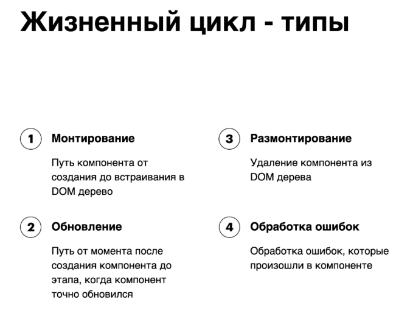

# Библиотека знаний

## Method shouldComponentUpdate()

У всех компонентов React при перерендере срабатывает метод жизненного цикла shouldComponentUpdate(), который сравнивает стейт и пропы компонента которые есть сейчас с тем что нам нужно накатить при следующем рендере. 

1. Классы
- React.Component - ререндерится всегда.
- React.PureComponent - рендерится только при сравнении shouldComponentUpdate().

2. Функциональные компонениы
- function component - ререндерится всегда.
- React.memo() - рендерится только при сравнении shouldComponentUpdate().

```tsx
function test() {
  console.log('test is printing');
  return <span>{props.test}</span>
}
// ⬇
const Test = React.memo(
  function test() {
    console.log('test is printing');
    return <span>{props.test}</span>
  }
)
```

## Инициализация состояния

```tsx
export class TestClass extends React.PureComponent<{}, TestState> {
  // 1. Через конструктор.
  constructor(props:{}) {
    super(props);
    this.state = { name: '123' };
  }

  // 2. Через перегрузку. Всегда generic Readonly!
  state: Readonly<TestState> = { name: '123' };
}
```

## setState()

### Переменные setState()

React не гарантирует что во время выполнения `setState`, `this.state` будет актуальным.  
Так что увеличение текущего значения от предыдущего нужно делать, передавая функцию.

```tsx
this.setState( {count: this.state.count + 1} ); // WRONG
this.setState( (state, props) => ({count: state.count + 1})); // RIGHT
```

### Задержка в setState()

`setState` кладет операцию в очередь и `console.log()`, вызванный сразу выведет неактуальное значение.  
Чтобы `console.log()` выводил актуальное значение после `setState` нужно его передавать в callback.

```tsx
state: Readonly<TestState> = { count: 0 };
this.setState( (state, props) => ({count: state.count + 1}));
console.log(this.state.count); // 0

this.setState( (state, props) => ({count: state.count + 1}), 
  () => { console.log(this.state.count) }); // 1
```

### Spread State

`setState` в фукнциональных компонентах не может обновлять одно значение отдельно, нужно либо обновлять все значения вручную, либо использовать Spread State `...prevState,`, который копирует все значения state.

```tsx
setState((prevState) => ({ name: randomName(), count: prevState.count + 1 }));
// =
setState((prevState) => ({ ...prevState, name: randomName() }));
setState((prevState) => ({ ...prevState, count: prevState.count + 1 }));
```

### Batching

React использует `batching` для группировки обновлений `state` внутри `event handler` или `inbuilt hooks`. Это предотвращает компонент от ре-рендера каджого отдельного обновления `state`, и оптимизирует приложение.

```tsx
this.setState( (state, props) => ({count: state.count + 1}));
this.setState( (state, props) => ({count: state.count + 1}));
```

## Хуки

`React.useState()` - объявляет состояние функции, принимает начальные значения `InitialState` и возвращает массив с состоянием и функцией-апдейтором (диспатчером) `[state, func]`. `InitialState` может быть как значением, так и функцией, возвращающей это значение.

`const [] = React.useState()` - хук

❗️ хуки можно применять только внутри функциональных компонентоа

```tsx
function test() {
  // useState принимает значение S
  const [state, func] = React.useState('123'); // S

  // useState принимает функцию, которая возвращает значение S
  const randomName = () => uniqueNamesGenerator({dictionaries: [starWars], length: 1})
  const [state, func] = React.useState(randomName); // () => S
}
```

## Дополнения

[Генератор React-компонентов](https://github.com/TaoriYu/generator-react-ts-component-dir)

Библиотека позволяет создавать папку с компонентом и всей структурой (.tsx, .ts, .css) одной командой в консоли:

```console
yo react-ts-component-dir name
```

[Redux DevTools](https://chrome.google.com/webstore/detail/redux-devtools/lmhkpmbekcpmknklioeibfkpmmfibljd?hl=en)

Расширение для браузера Chrome для отладки изменений состояния приложения. Создает в DevTools две дополнительные вкладки (Components & Profiler). Components - отражает все дерево компонентов, а также их свойства.

## Жизненный цикл компонента



`.sbp-SbOverlay` - скрыть bg плеера на Skillbox.
