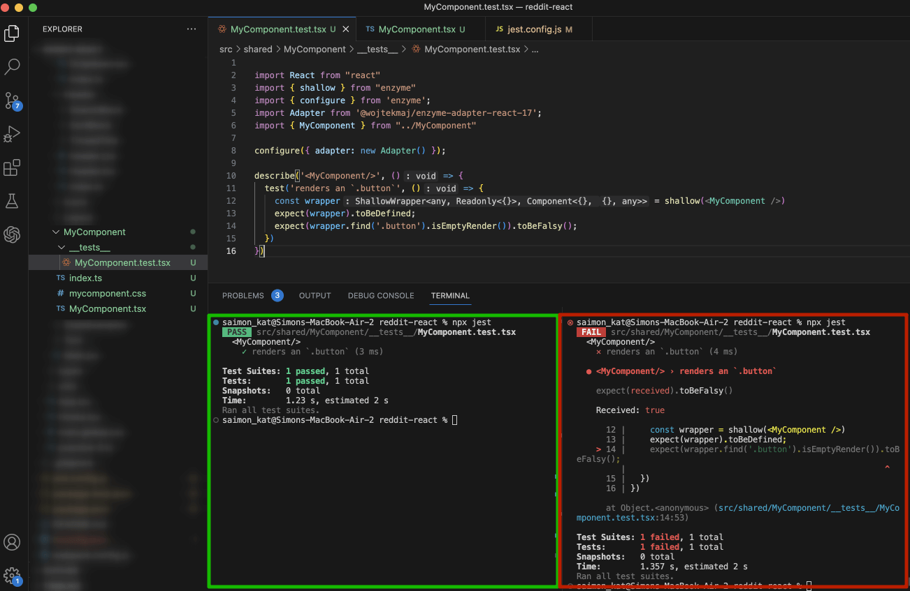

# Библиотека знаний

### Содержание
- [Введение в React](#введение-в-react)
  - [Основные особенности](#основные-особенности)
  - [Ограничения](#ограничения)
- [Компонентный подход](#компонентный-подход)
- [Жизненный цикл](#жизненный-цикл)
  - [Типы](#типы)
  - [Этапы](#этапы)
  - [Mount and unmount](#mount-and-unmount)
  - [shouldComponentUpdate()](#shouldcomponentupdate)
- [TypeScript](#typescript)
  - [Введение](#введение)
  - [Преимущества](#преимущества)
  - [Недостатки](#недостатки)
  - [Типы данных](#типы-данных)
    - [Примитивы](#примитивы)
    - [Специальные типы](#специальные-типы)
      - [Any](#any)
      - [Unknown](#unknown)
      - [Void](#void)
      - [Never](#never)
    - [Проверка типа](#проверка-типа)
    - [Комбинации типов](#комбинации-типов)
      - [Объединение](#объединение)
      - [Пересечение](#пересечение)
  - [Массивы](#массивы)
  - [Объекты](#объекты)
  - [Интерфейсы](#интерфейсы)
  - [Функции](#функции)
  - [Дженерики](#дженерики)
  - [Enum](#enum)
  - [Cheat Sheet](#cheat-sheet)
- [Хуки](#хуки)
  - [Введение](#введение-1)
  - [Полный список хуков](#полный-список-хуков)
  - [useState](#usestate)
    - [Переменные setState()](#переменные-setstate)
    - [Задержка в setState()](#задержка-в-setstate)
    - [Spread State](#spread-state)
    - [Batching](#batching)
  - [useEffect](#useeffect)
  - [useRef](#useref)
  - [Cheat Sheet](#cheat-sheet-1)
- [Portals](#portals)
- [Каррирование](#каррирование)
- [Компонент высшего порядка](#компонент-высшего-порядка)
- [Композиция утилитарных функций](#композиция-утилитарных-функций)
- [Условный рендеринг](#условный-рендеринг)
  - [Встроенные условия if](#встроенные-условия-if)
    - [Логический оператор if](#логический-оператор-if)
    - [Тернарный оператор if-else](#тернарный-оператор-if-else)
- [Авторизация](#авторизация)
  - [Auth token](#auth-token)
  - [User data](#user-data)
  - [Prop Drilling](#prop-drilling)
  - [useContext](#usecontext)
- [Unit-тесты](#unit-тесты)
  - [Jest](#jest)
  - [Enzyme](#enzyme)
  - [Snapshot](#snapshot)
  - [React Testing Library](#react-testing-library)
- [State Management](#state-management)
- [Дополнения](#дополнения)
  - [Ошибки установки пакетов](#ошибки-установки-пакетов)
  - [Генератор компонентов](#генератор-компонентов)
  - [Redux DevTools](#redux-devtools)

## Введение в React

**React** — это открытая (с открытым исходным кодом) JavaScript-библиотека для фронтенда, предназначенная для создания пользовательских интерфейсов, особенно, если речь идет о создании одностраничных приложений (Single Page Applications, SPA). Она отвечает за слой представления (view) в веб и мобильных приложениях. React был разработан Jordan Walke - инженером Facebook. React был представлен на Facebook News Feed в 2011 году, а для Instagram - в 2012 году.

### Основные особенности

- Создание одностраничных приложений (Single Page Applications, SPA).
- Использование VirtualDOM (виртуальной объектной модели документа) вместо RealDOM (настоящий или реальный DOM), поскольку манипуляции с RealDOM являются дорогостоящими с точки зрения производительности.
- Поддержка рендеринга на стороне сервера (Server Side Rendering, SSR).
- Следование принципу однонаправленного потока или связывания данных (one-directional data flow).
- Использование переиспользуемых (reusable) компонентов пользовательского интерфейса (User Interface, UI) для формирования слоя представления.

### Ограничения

React - это библиотека, это не фреймворк, как например Angular. Он служит для отрисовки интерфейсов и не поддерживает, допустим, валидацию форм.

## Компонентный подход

1. Зоны ответственности

Компоненты в React разделяются по зонам ответственности. Один компонент - одна ответственность (одна цель). Если компонент выполняет две задачи - это явный признак того, что его нужно разделить на два.

2. Адаптивная верстка

Если компонент просится быть разделенным не по логике, а по представлению (например, для адаптивных версий), то его не стоит разделять, чтобы не дублировать логику и не увеличивать кодовую базу.

> **Примечание: Компоненты всегда называются с заглавной буквы.** 
> 
> Если компонент начинается с маленькой буквы, React принимает его за DOM-тег. Например, `<div>` это div-тег из HTML, а `<Welcome />` это уже наш компонент Welcome, который должен быть в области видимости.

## Жизненный цикл

Каждый компонент React проходит несколько стадий в процессе своей жизни: он создается, затем добавляется в DOM, получает пропсы, и, наконец, удаляется из дерева. Этот процесс называют жизненным циклом компонента (Component Lifecycle). React предоставляет набор методов, которые позволяют встроиться в этот процесс.

Полный график жизненного цикла:


### Типы


### Этапы


### Mount and unmount


### shouldComponentUpdate()

У всех компонентов React при перерендере срабатывает метод жизненного цикла shouldComponentUpdate(), который сравнивает стейт и пропы компонента которые есть сейчас с тем что нам нужно накатить при следующем рендере. 

1. Классы
- React.Component - ререндерится всегда.
- React.PureComponent - рендерится только при сравнении shouldComponentUpdate().

2. Функциональные компонениы
- function component - ререндерится всегда.
- React.memo() - рендерится только при сравнении shouldComponentUpdate().

```tsx
function test() {
  console.log('test is printing');
  return <span>{props.test}</span>
}
// ⬇
const Test = React.memo(
  function test() {
    console.log('test is printing');
    return <span>{props.test}</span>
  }
)
```

## TypeScript

### Введение

TypeScript - это расширенная версия JavaScript. То есть он содержит в себе все то же самое, что и JavaScript, но с некоторыми дополнениями.

Главная причина использовать TypeSciprt - это возможность добавить статическую типизацию к JavaScript. Тип переменной со статической типизацией не может быть изменен после ее объявления. Это может предотвратить БОЛЬШОЕ количество багов.

С другой стороны, JavaScript - динамически типизированный язык, то есть типы переменных могуть изменяться. Например:

```js
// JavaScript
let foo = "Привет";
foo = 55; // тип переменной foo изменяется со строки на число - никаких проблем
```

```ts
// TypeScript
let foo = "Привет";
foo = 55; // ERROR - тип переменной foo не может быть изменен
```

TypeScript не воспринимается браузерами, поэтому его надо скомпилировать в JavaScript с помощью TypeScript Compiler (TSC) - мы обсудим его чуть позже.

### Преимущества

- Исследование показало, что TypeScript может обнаружить **15%** самых частых багов.

- **Читаемость** - намного проще видеть, что делает код. А при работе в команде проще видеть, что делают другие разработчики.

- **Популярность** - знание TypeScript позволит вам расширить круг вакансий, на которые вы сможете претендовать.

- Изучение TypeScript даст вам *лучшее понимание* и *новый взгляд* на JavaScript.

### Недостатки

- Написание кода на TypeScript занимает большее время, чем на JavaScript,так как необходимо типизировать переменные. Так что в небольших проектах, возможно, оно не стоит того.

- TypeScript необходимо компилировать, а это занимает время, особенно в больших проектах.

Однако время, которое вы потратите на написание более точного кода и компиляцию будет более чем компенсировано тем, сколько багов могло бы быть в вашем коде.

Для большинства проектов - средних и больших - TypeScript сэкономит вам много времени и сил.

Более того, если вы уже знаете JavaScript, то изучение TypeScript не составит вам большого труда. Он станет отличным инструментом в вашем арсенале.

### Типы данных

TypeScript поддерживает все основные типы данных JavaScript и расширяет их своими собственными.

```ts
// JS Types
type AllJsSimpleTypes = boolean | number | string | [] | object | undefined | null | void | symbol;

// TS Unique types
type UniqueTsTypes = any | unknown | never;
```

#### Примитивы
  
Примитивы - это данные, которые не являются объектами и не имеют методов. Всего есть 7 примитивных типов:

```ts
1. string    // строки
2. number    // числа
3. boolean   // true/false
4. bigint    // большие числа
5. undefined // значение еще не присвоено
6. null      // переменная недоступна
7. symbol    // уникальный идентификатор
```

В основном используются 3 первых примитива: *string*, *number* и *boolean*. Примитивы иммутабельны: они не могут быть изменены. Важно не путать сами примитивы и переменные, объявленные, как примитивы. Переменной может быть назначено новое значение, но текущее значение не может быть изменено, так же, как могут быть изменены объекты, массивы и функции.

При объявлении переменной можно явно указать ее тип или позволить TypeScript узнать тип из значения:

```ts
let tsStr1: string = 'asd'; // явное указание типа
let tsStr2 = 'asd'; // TS знает, что это строка
```

#### Специальные типы

##### Any

`Any` - специальный тип TypeScript, который описывает данные, тип которых может быть неизвестен на момент написания приложения. Переменная с таким типом может динамически менять тип.
const someAny: any = 2;

```ts
let value: any = "hello";
console.log(value);   // сейчас value - это string
value = 20; 
console.log(value);   // сейчас value - это number
```

Так как здесь применяется тип `any`, то данный код скомпилируется без ошибок, несмотря на смену строкового значения на числовое. 

Если переменная определяется без значения и указания типа, и только впоследствии при работе программы ей присваивается значение, тогда считается, что она имеет тип `any`:

```ts
let value;  // тип any
value = 10; 
value = "hello";
```

С одной стороны, `any` может показаться удобным типом. Однако, с другой стороны, он лишает программу преимуществ языка TypeScript, в частности, статической типизации. Соответственно может привнести в программу потенциальные ошибки, связанные с типизацией данных, которые компилятор не сможет отследить на этапе компиляции.

> В строгом режиме с помощью `"strict": true` в `tsconfig.json` использование any невозможно. А это значительно повышает безопасность кода.

##### Unknown

Бывают ситуации, когда тип неизвестен, но работа с ним должна быть безопасна с точки зрения типов. Для этого в TypeScript существует дополнение к `any` — еще один специальный тип `unknown`.

```ts
const un: unknown = '2';
un.concat(); // Error!

if (typeof un === 'string') {
  un.concat(); // working
}
```

##### Void

Обычно этот тип используется для запрета возвращения значения из функции. Если быть точным, то он указывает компилятору, что здесь не должно быть никакого типа. Хорошим примером будет функция, выводящая что-либо в `console.log`:

```ts
function warn(message: string): void {
	console.warn(message);
}
```

##### Never

Тип функции, которая никогда не выполняется до конца. Это может быть бесконечный цикл, выбрасывание исключения, или завершение функцией программы.

```ts
// Бесконечный цикл
function infiniteLoop(): never {
  while (true) {
    // Какая-то логика
  }
}

// Выбрасывание исключения
function stop(message: string): never {
  throw new Error(message);
}

// Завершение программы
function exit(code: number = 0): never {
  process.exit(code);
}
```

#### Проверка типа

С помощью оператора `typeof` мы можем проверить тип переменной. Это может быть необходимо, когда мы хотим выполнить некоторые операции с переменной, но нам неизвестен ее точный тип (например, переменная представляет тип `any`). Данная функциональность еще называется `type guards` или защита типа:

```ts
let sum: any;
sum = 1200;
 
if (typeof sum === "number") {
  let result: number = sum / 12;
}
else {
  console.log("invalid operation");
}
```

Оператор typeof может возвращать следующие значения:
- string
- number
- bigint
- boolean
- symbol
- undefined
- object
- function

#### Комбинации типов

##### Объединение

С помощью конструкции `Union` вы можете создать новую структуру (тип), которая будет являться объединением нескольких указанных типов. В TypeScript конструкция объединения имеет следующий синтаксис:

```ts
const isUnionType: boolean | string | number = true;
const isUnionType: boolean | string | number = 'string';
const isUnionType: boolean | string | number = 123;

const isUnionType: boolean | string | number = {};
// Error → Type '{}' is not assignable to type 'boolean | string | number'.
```

> Конструкцию вида `boolean | string | number` следует читать как: в этой переменной может находиться значение типа `boolean`, `string` или `number`. Аналогия с логическим оператором `||` – логическое **или**, то есть тип **объединение**.

##### Пересечение

Эта конструкция позволяет комбинировать несколько типов в один. Это означает, что если вы создадите два разных объекта и захотите написать одну общую функцию для них, то вам потребуется что-то универсальное, что может принимать два разных типа и возвращать их комбинацию. Соответственно, это может работать и с классами. Например, так это работает с объектами:

```ts
function extend<T, U>(a: T, b: U): T & U {
	return Object.assign({}, a, b);
}

// Совмещает тип T и U
const obj = extend({ one: 1 }, { two: 2 });

const one = obj.one; // 1
const two = obj.two; // 2
```

Здесь `T` и `U` – это некоторые типы `T` и `U`, соответственно, которые захватываются при вызове функции. Можно использовать любые буквы, которые вам хочется, но буквы на входе и выходе функции должны совпадать. Также, обратите внимание на конструкцию `<T, U>` после имени функции. Так как типы `T` и `U` в TypeScript не существуют и они не были объявлены где-то выше, то мы должны указывать их явно. Такая конструкция называется «обобщение» (generic) и подсказывает компилятору, что на входе мы имеем два типа, которые можно применить в теле функции, но эти типы он должен определить сам на основании того, как будет вызвана функция. Подробнее об обобщениях мы поговорим в следующей статье.

> Конструкцию вида `T & U` нужно читать как: тип, который объединяет в себе тип `T` и тип `U`. Аналогия с логическим оператором `&&` – логическое **и**, то есть тип **пересечение**.

### Массивы

В TypeScript вы можете указать, какой тип данных может содержать в себе массив:

```ts
let ids: number[] = [1, 2, 3, 4, 5]; // может содержать только цифры

let names: string[] = ['Alex', 'Anton', 'Nastya']; // может содержать только строки

let options: boolean[] = [true, false, false]; // может содержать true или false

let books: object[] = [
  { name: ' War and Peace', author: 'Leo Tolstoy' },
  { name: '1984', author: 'George Orwell' },
]; // может содержать только объекты

let arr: any[] = ['Hello', 1, true]; // превращает TypeScript в JavaScript
```

Вы можете использовать объединенные типы для объявления массива, который содержит в себе несколько типов данных:

```ts
let person: (string | number | boolean)[] = ['Name', 1, true];
person[0] = 100;
person[1] = {name: 'Денис'} // Error → Type '{}' is not assignable to type 'string | number | boolean'.
```

Также, как и для примитивов, если вы иницализируете массив со значением, то нет необходимсти указывать типы - TypeScript сделает это сам:

```ts
let person: (string | number | boolean)[] = ['Name', 1, true];
let person = ['Name', 1, true]; // идентично
```

В TypeScript вы можете объявить специальный тип массива - кортеж (или Tuple).  
**Кортеж** - это массив с фиксированным размером и известным набором данных. Он более строгий, чем обычные массивы.

```ts
const myTuple: [number, string] = [1, '2'];
```

### Объекты

Как и в JavaScript, объекты в TypeScript — один из основных способов структурирования данных.

TypeScript может вывести тип объекта из значений его полей:

```ts
const user = {
  id: 123,
  name: 'Jack'
}
```

Или можно присвоить заранее продуманный анонимный тип:

```ts
const user: { 
  id: number, 
  name: string 
} = { 
  id: 123,
  name: 'Jack'
};
```

Однако, самым лучшим решением будет использование интерфейсов (некого шаблона объекта):

```ts
interface User {
  id: number;
  name: string;
}
 
const user: User = {
  id: 123,
  name: "Jack",
};
```

Или указать тип, используя псевдоним типа:

```ts
type User = {
  id: number;
  name: string;
}
 
const user: User = {
  id: 123,
  name: "Jack",
};
```

### Интерфейсы

Интерфейс — это особый тип, который подсказывает TypeScript, какие имена и типы свойств может иметь объект. При определении нового объекта TypeScript «в фоне» создает интерфейс к нему. Для следующего объекта TypeScript создаст интерфейс из двух полей: `id` с типом `number` и `name` с типом `string`:

```ts
const user = {
  id: 123,
  name: "Jack",
};
```

Интерфейсы могут быть определены и явно:

```ts
interface User {
  id: number;
  name: string;
}
 
const user: User = {
  id: 123,
  name: "Jack",
};
```

Таким образом, при работе с таким объектом TypeScript будет знать, из каких полей он состоит. Это позволит сделать необходимые проверки везде, где будет использоваться этот объект.

> Еще одно преимущество работы с типизированными объектами — редактор кода сможет подсказать свойства объекта и давать подсказки по мере ввода кода.

Поля интерфейсов могут быть необязательными (optional) или защищенными от переопределения:

```ts
interface MyInterface {
  a?: number;          // необязательное
  readonly b: string;  // нельзя переопределять
}
```

Помимо примитивный типов и других интерфейсов, в интерфесах можно описывать функции. Делается это с помощью стрелочных функций:

```ts
interface ICalculator {
	sum: (a: number, b: number) => number;
}
```

Интерфейсы можно расширять, но не наследовать. Расширение применяется в том случае, если вам нужно, чтобы новый интерфейс имел не только все свойства какого-то интерфейса, но и имел дополнительные или уникальные для этого интерфейса свойства.

```ts
interface IResponse {
	status: number;
}

interface ISlackResponse extends IResponse {
	ok: boolean;
}
```

### Функции

TypeScript позволяет типизировать как передаваемые в функцию, так и возвращаемые значения. Обычно TypeScript может вывести возвращаемое значение без специальной аннотации. Но разработчики часто указывают значение явно, чтобы улучшить читабельность кода и упростить жизнь компилятору TypeScript.

```ts
function add(a: number, b: number): number {
  return a + b;
}
```

То же самое, но со стрелочной функцией ES6:

```ts
const add = (a: number, b: number): number => {
  return a + b;
}
```

Чтобы сделать параметр функции необязательным можно добавить вопросительный знак после него. Также для типизации параметров и вовзращаемого значения функции можно использовать Union type.

```ts
const add = (a: number, b: number, c?: number | string) => {
	console.log(c);
  return a + b;
};
```

### Дженерики

Дженерики, или обобщенные типы, полезны в случаях, когда функция или класс могут работать с разными типами. Чтобы не дублировать код или чтобы не использовать тип any, можно создать «переменную типа». Таким образом тип можно будет задать позднее, во время вызова функции. Дженерики позволяют использовать типы, явно не задавая их.

Например, функции, которые конвертируют аргументы разного типа в массив, могут выглядеть так:

```ts
function stringToArray(value: String): Array {
  return [value];
}
 
function numberToArray(value: Number): Array {
  return [value];
}
 
function userToArray(value: User): Array {
  return [value];
}
 
interface User {
  id: number;
  name: string;
}
```

Дженерики позволяют избежать дублирования и предопределить тип аргумента и возвращаемого значения. Как только функция получит значение определенного типа, мы будем уверены, что она вернет массив того же типа.

```ts
function valueToArray(value: T): Array {
  return [value];
}
 
const array = convertToValueArray({ id: 123, name: 'Jack'})
array[0].id // 123
array[0].name // 'Jack'
array[0].city // Error: Property 'city' does not exist on type
```

### Enum

Тип `enum` используется для объявления перечисления — отдельного типа, который состоит из набора именованных констант, называемого списком перечислителей. Например, вы можете создать `enum` дней. По умолчанию первый перечислитель имеет значение 0, и значение каждого последующего перечислителя инкрементируется на единицу.

```ts
enum Days { Sat, Sun, Mon, Tue, Wed, Thu, Fri };
```

### Cheat Sheet

Здесь собрана шпаргалка по всем основам и типам в TypeScript.

[TypeScript Cheat Sheet (Light)](img/typescript-cheat-sheet--light.jpg)  
[TypeScript Cheat Sheet (Dark)](img/typescript-cheat-sheet--dark.jpg)


## Хуки

### Введение

[Хуки](https://ru.legacy.reactjs.org/docs/hooks-intro.html) — нововведение в React 16.8, которое позволяет использовать состояние и другие возможности React без написания классов. 

Хуки — это функции, с помощью которых вы можете «подцепиться» к состоянию и методам жизненного цикла React из функциональных компонентов. Хуки не работают внутри классов — они дают вам возможность использовать React без классов.

```tsx
import React, { useState } from 'react';

function Example() {
  // Объявление переменной состояния, которую мы назовём "count"
  const [count, setCount] = useState(0);

  return (
    <div>
      <p>Вы кликнули {count} раз</p>
      <button onClick={() => setCount(count + 1)}>
        Нажми на меня
      </button>
    </div>
  );
}
```

### Полный список хуков
1. useState
2. useEffect
3. useRef
4. useReducer
5. useMemo
6. useContext
7. useCallback
8. useImperativeHandle
9. useLayoutEffect
10. useDebugValue

### useState

Самый популярный хук, используемый в React - функция `useState()``.

`React.useState()` - объявляет состояние функции, принимает начальные значения `InitialState` и возвращает массив с состоянием и функцией-апдейтором (диспатчером) `[state, func]`. `InitialState` может быть как значением, так и функцией, возвращающей это значение.

`const [] = React.useState()`

❗️ хуки можно применять только внутри функциональных компонентоа

```tsx
function test() {
  // useState принимает значение S
  const [state, func] = React.useState('123'); // S

  // useState принимает функцию, которая возвращает значение S
  const randomName = () => uniqueNamesGenerator({dictionaries: [starWars], length: 1})
  const [state, func] = React.useState(randomName); // () => S
}
```

#### Переменные setState()

React не гарантирует что во время выполнения `setState`, `this.state` будет актуальным.  
Так что увеличение текущего значения от предыдущего нужно делать, передавая функцию.

```tsx
this.setState( {count: this.state.count + 1} ); // WRONG
this.setState( (state, props) => ({count: state.count + 1})); // RIGHT
```

#### Задержка в setState()

`setState` кладет операцию в очередь и `console.log()`, вызванный сразу выведет неактуальное значение.  
Чтобы `console.log()` выводил актуальное значение после `setState` нужно его передавать в callback.

```tsx
state: Readonly<TestState> = { count: 0 };
this.setState( (state, props) => ({count: state.count + 1}));
console.log(this.state.count); // 0

this.setState( (state, props) => ({count: state.count + 1}), 
  () => { console.log(this.state.count) }); // 1
```

#### Spread State

`setState` в фукнциональных компонентах не может обновлять одно значение отдельно, нужно либо обновлять все значения вручную, либо использовать Spread State `...prevState,`, который копирует все значения state.

```tsx
setState((prevState) => ({ name: randomName(), count: prevState.count + 1 }));
// =
setState((prevState) => ({ ...prevState, name: randomName() }));
setState((prevState) => ({ ...prevState, count: prevState.count + 1 }));
```

#### Batching

React использует `batching` для группировки обновлений `state` внутри `event handler` или `inbuilt hooks`. Это предотвращает компонент от ре-рендера каджого отдельного обновления `state`, и оптимизирует приложение.

```tsx
this.setState( (state, props) => ({count: state.count + 1}));
this.setState( (state, props) => ({count: state.count + 1}));
```

### useEffect

Хук `useEffect` позволяет управлять различными сопутствующими действиями в функциональном компоненте или то, что называется "side effects" (побочные эффекты), например, извлечение данных, ручное изменение структуры DOM, использование таймеров, логгирование и т.д.. То есть в `useEffect` выполняет те действия, которые мы не можем выполнить в основной части функционального компонента. Этот хук фактически служит той же цели, что методы жизненного цикла `componentDidMount`, `componentDidUpdate` и `componentWillUnmount` в классах-компонентах.

```tsx
// Объявляем новую переменную состояния "count"
const [count, setCount] = useState(10);

useEffect(() => {
  // Обновляем заголовок документа, используя API браузера
  document.title = `Вы нажали ${count} раз`;
});

return (
  <div>
    <p>
      Вы нажали {count} раз
      &nbsp;
      <button onClick={() => setCount(count + 1)}>
        [+ 1]
      </button>
      &nbsp;&nbsp;&nbsp;
      <button onClick={() => setCount(count - 1)}>
        [- 1]
      </button>
    </p>
  </div>
);
```

В примере выше `useEffect()` выполняется при каждом рендере компонента. В некоторых случаях это может вызвать проблему с производительностью. Вы можете сделать так, чтобы React пропускал вызов эффекта, если определённые значения остались без изменений между последующими рендерами. Чтобы сделать это, передайте массив в `useEffect` вторым необязательным аргументом: 

```tsx
// без второго аргумента выполняются изначально и при каждом измении
React.useEffect(() => {
  console.log('componentDidMount');
  console.log('componentWillUpdate');
})

// со вторым пустым аргументом выполняется только изначально
React.useEffect(() => {
  console.log('componentDidMount');
}, [])

// со вторым аргументом выполняется при каждом изменении аргумента
React.useEffect(() => {
  console.log('componentWillRecieveProps: ', title);
}, [title])
```

### useRef

Хук `useRef` позволяет сохранить некоторый объект, который можно можно изменять и который хранится в течение всей жизни компонента. Например, 

В качестве параметра функция `useRef()` принимает начальное значение хранимого объекта. А возвращаемое значение - ссылка-объект, из свойства `current` которого можно получить хранимое значение.

```tsx
const refUser = useRef("Tom");
console.log(refUser.current);   // Tom
```

Расспространенным примером применения useRef является хранение ссылки на html-элементы внутри компонента:

```tsx
function UserForm() {
  const nameField = React.useRef(null);

  const send = () => {
    // свойство current указывает на элемент input
    const inputElement = nameField.current;
    console.log("Имя: " + inputElement.value);
  };

  return (
    <div>
      <input type="text" ref={nameField} />
      <button onClick={send}>Отправить</button>
    </div>
  );
}
```

> Так как ref по сути является лазейкой, старайтесь избегать его использования и стараться решать задачи через `useState` и `props`.

Хук useRef оправдан в следующих случаях:

- управление фокусом в инпуте `inputRef.current.focus()`
- выделение текста в инпуте `inputRef.current.select()`
- воспроизведение медиа `videoRef.current.play()`
- императивный вызов анимаций `ref.current.animate(...)`
- интеграция со сторонними DOM-библиотеками `videojs(ref.current)`

### Cheat Sheet

Здесь собрана шпаргалка по всем основным хукам в React.

[React Hooks Cheat Sheet](files/React-Hooks-cheat-sheet.pdf)

## Portals

Порталы позволяют рендерить дочерние элементы в DOM-узел, который находится вне DOM-иерархии родительского компонента.

```tsx
ReactDOM.createPortal(child, container)
```

Первый аргумент `child` — это любой React-компонент, который может быть отрендерен, такой как элемент, строка или фрагмент. Следующий аргумент `container` — это DOM-элемент, в который мы поместим `child`.

Типовой случай применения порталов — когда в родительском компоненте заданы стили `overflow: hidden` или `z-index`, но вам нужно чтобы дочерний элемент визуально выходил за рамки своего контейнера. Например, реализация модальных окон, диалогов, или всплывающиех подсказок. 

Рассмотрим пример реализации модального окна.

1. Создаем DOM-ноду `modal-root` для модалки рядом с `app-root`:

    ```html
      <body>
        <div id="react_root">${content}</div>
        <div id="modal_root"></div>
      </body>
    ```
2. Создаем компонент модалки `Modal.tsx` в папке `shared` используя портал `ReactDOM.createPortal`:

    ```tsx
    export function Modal({isOpen, onClose}: any) {
      const node = document.querySelector('#modal_root');
      if (!node) return null;

      return ReactDOM.createPortal((
        <div className={styles.modal}>
          ...
        </div>
      ), node);
    ```

3. Теперь мы можем использовать нашу модалку в любом месте приложения:

    ```tsx
    import { Modal } from '../Modal';

    export function MyConmonent() {
      const [isModalOpened, setIsModalOpened] = useState(false);

      return (
        <div>
          {isModalOpened && <Modal/>}
        </div>
      );
    }
    ```

## Каррирование

[Каррирование](https://medium.com/@websimplified.solutions/currying-react-c7cfc44f5c78) — это метод функционального программирования, при котором функция с несколькими аргументами преобразуется в последовательность функций, каждая из которых принимает один аргумент. 

Это позволяет нам частично применять аргументы и создавать новые функции с меньшим количеством параметров.

Трансформация функций происходит таким образом, чтобы они принимали аргументы не как f(a, b, c), а как f(a)(b)(c).

```tsx
// Каррирование функции add(1,2) -> add(1)(2)
function add(leftSide: number) => (rightSide: number) => leftSide + rightSide;
add(1)(2); // -> 3

// Переиспользование для создания других функций
const addOne = add(1);
addOne(5) // -> 6
``` 

## Компонент высшего порядка

[Компонент высшего порядка (HOC)](https://legacy.reactjs.org/docs/higher-order-components.html) — это продвинутый метод в React для повторного использования логики компонента.

**Функции высшего порядка** - функции, которые принимают другие функции, или возвращают другие функции.

Каррированные функции являются **функциями высшего порядка**, так как или возвращают функции.

Пример функции высшего порядка - `window.addEventListener('resize', () => {})`, так как `addEventListener` принимает другую функцию.

Пример ближе к реальной жизни - компонент, который обрабатывает изменения ввода формы. Вместо написания отдельных обработчиков событий для каждого поля ввода мы можем использовать каррирование для создания единого обработчика событий, который динамически обновляет состояние на основе поля ввода.

```tsx
function MyComponent() {
  const [state, setState] = useState({ name: '', email: '', notes: '' });

  const handleChange = (fieldName) => (event) => {
    const { value } = event.target;
    setState((prevState) => ({
      ...prevState,
      [fieldName]: value,
    }))
  }

  return (
    <div>
      <input
        type="text"
        placeholder="Enter your name"
        value={state.name}
        onChange={handleChange('name')}
      />
      <input
        type="text"
        placeholder="Enter your email"
        value={state.email}
        onChange={handleChange('email')}
      />
      <textarea
        placeholder="Enter your notes"
        value={state.notes}
        onChange={handleChange('notes')}
      />
      <button>Submit</button>
    </div>
  )
}
```

## Композиция утилитарных функций

Функции compose() и pipe() принимают в качестве аргумента другие функции и исполняет их поочереди.

`compose()` - справа налево, `pipe()` - слева направо.

`compose()` - более логичный с программной точки зрения, `pipe()` - для чтения.

✅ *В Redux уже встроена функция `compose()`*

❓ Единственная проблема хэлперов - типизация. Для решения проблемы типизации, и чтобы не писать утилитарные функции руками - можно использовать готовые библиотеки, например [Ramda](https://ramdajs.com/docs/). Ramda - очень продуманная, стабильная и хорошо типизированная либа, которую можно использовать в проде. Ramda используют многие большие компании.

```tsx
function compose<U>(... fns: Function[]) {
  return <E,>(initialValue: any): U => 
    fns.reduceRight((previousValue, fn) => 
      fn(previousVlaue), initialValue);
}

function pipe<U>(... fns: Function[]) {
  return <E,>(initialValue: any): U => 
    fns.reduceRight((previousValue, fn) => 
      fn(previousVlaue), initialValue);
}

function InputExample({ value, onChange}: any) {
  return (
    <input
      value={value}
      onChange={preventDefault(stopPropagation(getValue(onChange)))}
      onChange={compose(onChange, getValue, stopPropagation, preventDefault)}
      onChange={compose(preventDefault, stopPropagation, getValue, onChange)}
    />
  )
}

// Забирает из объекта свойства по ключу
function pick<K extends string>(prop: T) {
  return <O extends Record<K, any>>(obj: O) => obj[prop];
}

const some = pick('value')({value: 1}) // -> 1

// Проверяет аргументы на равенство
function isEqual<T>(left: T) {
  return <E extends T>(right: E) => left === right;
}

// Инвертирует аргумент
function cond(b: boolean) {
  return !b;
}

// Пример композиции функций - удаление комментария
const comments = [{id: 22, text: 'text One'}, {id: 44, text: 'text Two'}];
const filteredComments = comments.filter(({ id }) => id !== 22);
// можем заменить фильтрацию на композицию хэлперов
const filteredComments = comments.filter(pipe(pick('id'), isEqual(22), cond));
// далее можем вынести композицию в отдельную функцию для переиспользования
const filterWithId = (id: number) => pipe(pick('id'), isEqual(22), cond);
const filteredComments = comments.filter(filterWithId(22));
```

## Условный рендеринг

React позволяет разделить логику на независимые компоненты. Эти компоненты можно показывать или прятать в зависимости от текущего состояния.

Условный рендеринг в React работает так же, как условные выражения работают в JavaScript. Бывает нужно объяснить React, как состояние влияет на то, какие компоненты требуется скрыть, а какие — отрендерить, и как именно. В таких ситуациях используйте условный оператор JavaScript или выражения подобные `if`.

```tsx
function UserGreeting(props) {
  return <h1>С возвращением!</h1>;
}

function GuestGreeting(props) {
  return <h1>Войдите, пожалуйста.</h1>;
}

function Greeting(props) {
  const isLoggedIn = props.isLoggedIn;
  if (isLoggedIn) {
    return <UserGreeting />;
  }
  return <GuestGreeting />;
}

const root = ReactDOM.createRoot(document.getElementById('root')); 
// Попробуйте заменить на isLoggedIn={true}:
root.render(<Greeting isLoggedIn={false} />);
```

### Встроенные условия if

Вы можете внедрить любое выражение в JSX, заключив его в фигурные скобки. 

#### Логический оператор if

Если нужно вставить элемент в зависимости от условия, используем `&&` из JS:

```tsx
const count = 0;
return (
  <div>
    {count && <h1>Количество сообщений: {count}</h1>}
  </div>
);
```

#### Тернарный оператор if-else

Если нужно выбрать тот или иной элемент в зависимости от условия, используем if-else из JS:

```tsx
const isLoggedIn = this.state.isLoggedIn;
return (
  <div>
    Пользователь <b>{isLoggedIn ? 'сейчас' : 'не'}</b> на сайте.
  </div>
);
```


## Авторизация

Расписать:
- основы аутентификации через сторонние сервисы

### Auth token

Расписать:
- работа с API стороннего сериса
- формирование ссылки для авторизации через сторонний сервис
- получение токена после обратного редиректа
- регистрация поля для токена в window
- сохранение токена через useState, useEffect и window

### User data

Расписать:
- получение даннх пользователя через токен, axios и API-запросы

### Prop Drilling

Prop Drilling — это, ситуация, когда одни и те же данные отправляются почти на каждом уровне вложенности из-за необходимости на конечном уровне. Например, мы получаем токен авторизации в корне приложения, в `AppComponent`(). Чтобы пробросить токен в компонент `UserBlock`, вложенный в `SearchBlock`, который вложен в `Header`, нам нужно пробросить его через все эти уровни вложенности. Вот схема, чтобы лучше это продемонстрировать:


Проблема с `Prop Drilling` в том, что всякий раз, когда понадобятся данные из родительского компонента, они должны будут поступать с каждого уровня поочереди, несмотря на то, что там они не нужны.

Лучшая альтернатива этому — использование хука [useContext](https://react.dev/reference/react/useContext). 

### useContext

Хук [useContext](https://react.dev/reference/react/useContext) основан на `Context API` и работает c помощью виджетов `Provider` и `Consumer`. Чтобы использовать данные на вложенных компонентах, необходимо обернуть эти компоненты в `Provider` и получить данные в компоненте, используя `Consumer` или перехватчик `useContext`. Context - это глобальная переменная, она обновляется только при передаче нового объекта в качестве value.

`Provider` - передает данные в приложение  
`Consumer` - получает их в любом месте приложения

1. Создаем файл с контекстом, например, `tokenContext.ts`:

    ```tsx
    export const tokenContext = React.createContext('');
    ```

2. Добавляем `Provider` в `App.tsx` и оборачиваем в `<Provider>` все приложение:

    ```tsx
    import { tokenContext } from './context/tokenContext';

    const [token] = useToken();
      
    return (
      <tokenContext.Provider value={token}>
        <Layout>
          // ...
        </Layout>
      </tokenContext.Provider>
    )
    ```

3. И затем в компоненте можем получить доступ к этому контексту 2 способами:

    3.1. Обернув его в `Consumer`:

    ```tsx
    import { tokenContext } from "../context/tokenContext";

    const { Consumer } = tokenContext;

    return (
      <Consumer>
        {(token) => <Block token={token} />}
      </Consumer>
    )
    ```

    3.2. Или же просто используя `useContext`:

    ```tsx
    import { tokenContext } from "../context/tokenContext";

    const { Consumer } = tokenContext;
    const token = useContext(tokenContext);

    return (
     <Block token={token} />
    )
    ```

## Unit-тесты

Модульное тестирование (юнит-тестирование) - процесс, позволяющий проверить на корректность отдельные модули кода, или наборы модулей. Идея в том, чтобы писать тесты для каждой нетривиальной функции или метода. Это позволяет быстро проверить, не привело ли изменение кода к регрессии (ошибкам в уже оттестированном коде).

> Покрывать Unit-тестами верстку нет смысла, нужно тестировать логику: хуки, стейты, обработчики ивентов, коллбеки и прочее.

Примеры самых простых тестов:
```tsx
expect(1 + 1).toBe(2)

if ( (1 + 1) !== 2 ) { throw new Error('assertion failed') }
```

База для тестов - фунукция test
```tsx
test('name;', () => {
  expect(1 + 1).toBe(2)
})
```

Добавить описание можно с помощью describe()
```tsx
describe('Math.max', () => {
  test('should return 2 when add one and one', () => {
    expect(1 + 1).toBe(2)
  })

  // Describe могут быть вложенными
  describe('again', () => {
    test('sss', () => {})
  })
})
```

### Jest

Основная библиотека для тестирования - [Jest](https://jestjs.io/docs/tutorial-react).

Для написания теста компонента создаем в нем папку `__tests__` и создаем в ней файл с тестами `MyComponent.test.tsx`.

Запуск теста:
```console
npx jest --watch
```

> Jest из коробки не умеет тестировать React-компоненты, поэтому для тестирования можно использовать библиотеки [Enzyme](https://enzymejs.github.io/enzyme/), [Snapshot](https://jestjs.io/docs/snapshot-testing) или [React Testing Library](https://testing-library.com/docs/react-testing-library/intro)

### Enzyme

[Enzyme](https://enzymejs.github.io/enzyme/) имеет множество методов для тестирования и выводит результат в консоли. 

Разберем самый простой пример, который проверяет рендер кнопки с классом `.button` внутри компонента `<MyComponent/>`:

```tsx
describe('<MyComponent/>', () => {
  test('renders an `.button`', () => {
    const wrapper = shallow(<MyComponent />);
    expect(wrapper).toBeDefined;
    expect(wrapper.find('.button').isEmptyRender()).toBeFalsy();
  })
})
```

Скриншот с результатами PASS и FAILED тестов:



> Enzyme - относительно устаревшая библиотека, и не имеет официальной поддержки React 17 и 18. Для использования на React 17 можно использовать неофициальный ападтер [enzyme-adapter-react-17](https://www.npmjs.com/package/@wojtekmaj/enzyme-adapter-react-17).

### Snapshot

[Snapshot](https://jestjs.io/docs/snapshot-testing) - позволяет рендерить [Enzyme](#enzyme) в качестве снэпшота, который отображают рендер компонента и хранит предыдущие версии тестов. То есть грубо говоря создает слепки компонента и позволяет сверять их друг с другом.

```tsx
describe('<MyComponent/>', () => {
  test('renders <MyComponent/>', () => {
    const wrapper = shallow(<MyComponent />);
    expect(wrapper).toMatchSnapshot();
  })
})
```

Такой тест Snapshot создаст в папке `__test__` компонента папку `__snapshots__`, в ней создаст файл `MyComponent.test.tsx.snap` и сохранит текущее состояние компонента:


Далее, если изменить компонент и заново запустить тест, Snapshot тест упадет, он отметит изменения и предложит либо исправить код, либо обновить snapshot. 

### React Testing Library

React Testing Library - самая современная и удобная библиотека для тесирования React-компонентов, строится на основе [DOM Testing Library](https://jestjs.io/docs/tutorial-react) добавления API для работы с компонентами React.

> Примечание: проекты, созданные с использованием `Create React App` уже имеют встроенную поддержку **React Testing Library**.

Пример использования для тестирования чекбокса:

```js
import {fireEvent, render} from '@testing-library/react';
import CheckboxWithLabel from '../CheckboxWithLabel';

it('CheckboxWithLabel changes the text after click', () => {
  const {queryByLabelText, getByLabelText} = render(
    <CheckboxWithLabel labelOn="On" labelOff="Off" />,
  );

  expect(queryByLabelText(/off/i)).toBeTruthy();

  fireEvent.click(getByLabelText(/off/i));

  expect(queryByLabelText(/on/i)).toBeTruthy();
});
```

## State Management

Список всех актуальных на сегодня стейт-менеджеров


В первую очередь стейт-менеджеры нужны, чтобы отделить бизнес-логику от компонентов и избавиться от проблемы пропс-дриллинга. Мы выносим все нужные стейты в отдельный `Store` и в нужных компонентах этот `Store` используем. Таким образом, мы не прокидываем пропсы по цепочке компонентов.


Базово Redux предоставляет одного глобальное хранилище для стетов - `global Store`. Но сейчас почти по всех современных стейт-менеджерах применяется концепция отдельных сторов для каждого модуля. То есть создаем разные сторы, которые хранят разные данные, по-разному их обрабатывают и их можно использовать в нужных местах отдельно.

## Дополнения

### Ошибки установки пакетов

Pass the `--legacy-peer-deps` flag when using npm commands.

### Генератор компонентов

[Генератор React-компонентов](https://github.com/TaoriYu/generator-react-ts-component-dir)

Библиотека позволяет создавать папку с компонентом и всей структурой (.tsx, .ts, .css) одной командой в консоли:

```console
yo react-ts-component-dir name
```

### Redux DevTools

[Redux DevTools](https://chrome.google.com/webstore/detail/redux-devtools/lmhkpmbekcpmknklioeibfkpmmfibljd?hl=en)

Расширение для браузера Chrome для отладки изменений состояния приложения. Создает в DevTools две дополнительные вкладки (Components & Profiler). Components - отражает все дерево компонентов, а также их свойства.
